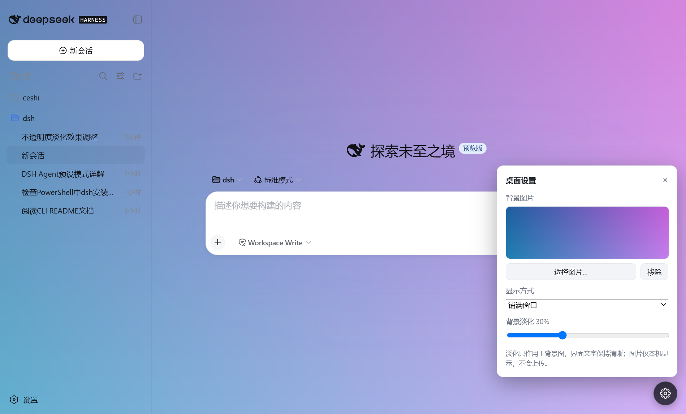

# dsh-desktop — DeepSeek Harness 桌面版

> **中文** | [English](README.en.md)

把「PowerShell 里跑 `dsh web`，再开浏览器访问 http://127.0.0.1:3080」的流程，
打包成 ChatGPT 桌面版风格的轻量桌面应用：**双击即用**，窗口内使用与浏览器
**完全一致**的 Web UI，并支持**自定义背景图片**。



## ✨ 特性

- **即装即用**：安装程序内置便携 Node.js 与 dsh 运行时，无需安装 Node、无需
  克隆仓库、无需命令行；双击图标自动启动服务并打开聊天窗口，退出时自动清理
- **UI 与 WebUI 保持一致**：Web 代码零改动，浏览器访问时界面逐字节不变
- **自定义背景图片**：右下角齿轮按钮 →「桌面设置」面板
  - 选择本地图片（png / jpg / webp / gif / bmp）
  - 显示方式：铺满窗口 / 完整显示 / 平铺 / 居中
  - **背景淡化**滑杆（0–90%）：只淡化背景图层，UI 文字始终清晰
  - 移除背景；设置持久化保存
- **与主题插件兼容**：未设置背景图时不覆盖任何样式；设置背景图时仅接管主表面
  token（bg-base / bg-layer-1 / sidebar-fill），主题插件的其余 token 始终生效
- **单实例运行**；若 127.0.0.1:3080 已有正在运行的 dsh web 则直接复用

## 🚀 快速开始（即装即用）

1. 在 Windows 10/11 机器上运行 `DeepSeek Harness Setup.exe` 完成安装
   （安装包也可直接从 [Releases](https://github.com/Aliarrrrr/dsh-desktop/releases) 页面下载）
2. 双击桌面/开始菜单的「DeepSeek Harness」
3. 应用自动完成：启动内置服务 → 打开聊天窗口 → 退出时清理进程树

> 安装体积约 450MB（内含 Electron、便携 Node.js 22 与 `@deepseek-ai/dsh`
> 运行时）。除调用模型 API 需要网络外，安装后无需联网即可使用（首次启动会在
> `%USERPROFILE%\.dsh` 建立本地配置）。

## 🛠 从源码开发

```sh
cd dsh-desktop
npm install            # 安装 electron / electron-builder
npm start              # 启动桌面应用
npm run smoke          # 自动化冒烟测试（截图输出到项目根目录）
npm run security-check # 静态安全审计（28 项断言）
```

## 📦 打包发布

```sh
npm run bundle:server  # 拉取内置 dsh 运行时 + 便携 Node 到 bundle/
npm run dist           # 打包内置运行时并生成 NSIS 安装程序（release/）
npm run dist:dir       # 仅生成免安装的 release/win-unpacked/ 目录
```

## 🎨 背景图片功能

- **淡化语义**：滑杆越高背景图越接近主题底色（浅色主题向白色淡化、深色主题向
  深色淡化），淡化只作用于背景图层，界面文字不受影响
- **主题适配**：淡化颜色在首次应用时按当前主题捕获并缓存，调整滑杆不会改变
  淡化方向；深色/浅色主题自动适配
- **插件兼容**：背景功能通过注入页面脚本实现，Web 代码零改动；浏览器直接访问
  服务时不存在任何注入痕迹

## 🔒 安全

安全模型、加固措施与验证结果详见 [SECURITY.md](SECURITY.md)：

- 渲染进程隔离（contextIsolation 开启、无 Node 能力、桥接 API 固定且不可篡改）
- IPC 固定白名单 + 参数校验 + 路径穿越防护；无 eval / shell 拼接
- 服务仅绑定 127.0.0.1；背景图片仅本机保存，不会上传
- 静态审计 `npm run security-check` + 冒烟测试内置运行时隔离探针

> 已知边界：安装程序未做代码签名，首次运行可能触发 SmartScreen 提示。

## 📁 数据位置

| 内容 | 位置 |
| --- | --- |
| 桌面设置 | `%APPDATA%\DeepSeek Harness\settings.json` |
| 背景图片 | `%APPDATA%\DeepSeek Harness\backgrounds\` |
| dsh 会话/配置 | `%USERPROFILE%\.dsh`（DSH_HOME） |

## 🗂 项目结构

```
dsh-desktop/
├─ src/                    # 应用源码
│  ├─ main.js              # 主进程：窗口、服务生命周期、设置持久化、IPC
│  ├─ server.js            # dsh web 服务子进程管理（bundled → 仓库 → npx）
│  ├─ preload.js           # 渲染进程桥接（固定 API）
│  └─ inject.js            # 注入页面脚本：背景应用器 + 桌面设置面板
├─ assets/                 # 图标与启动闪屏
├─ scripts/                # 打包、冒烟、安全审计、调试工具
├─ bundle/                 # 内置运行时（构建时生成，不入库）
├─ release/                # 打包产物（不入库）
├─ SECURITY.md             # 安全设计与验证
└─ package.json
```

## ❓ 常见问题

**端口冲突？** 服务端口由系统自动分配；若 3080 已有 dsh web 服务则直接复用
（`DSH_DESKTOP_NO_REUSE=1` 可关闭复用）。

**首次启动较慢？** 首次运行会在本地建立 dsh 配置与依赖链接，之后启动即为秒级。

**杀软/系统提示未知发布者？** 安装包未签名，正式分发前请补代码签名证书。

**想用本地仓库而不是内置运行时？** 设置 `DSH_DESKTOP_REPO` 指向
`deepseek-harness` 检出路径即可；服务定位优先级见 `src/server.js`。

## 📄 许可

MIT License，版权归 Aliarrrrr 所有（见 [LICENSE](LICENSE)）。
第三方依赖许可见 [THIRD_PARTY_NOTICES.md](THIRD_PARTY_NOTICES.md)。

本项目封装自 `@deepseek-ai/dsh`（DeepSeek Harness，MIT 许可，见其项目主页）；
Electron（MIT）与 Chromium 组件许可见各自项目。
